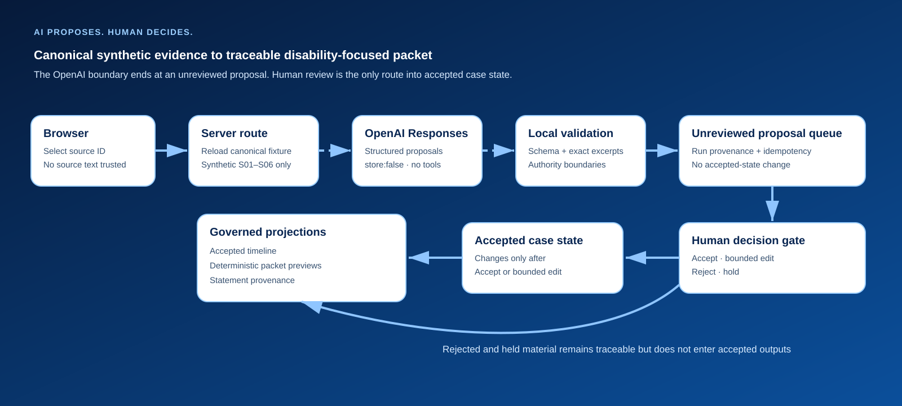
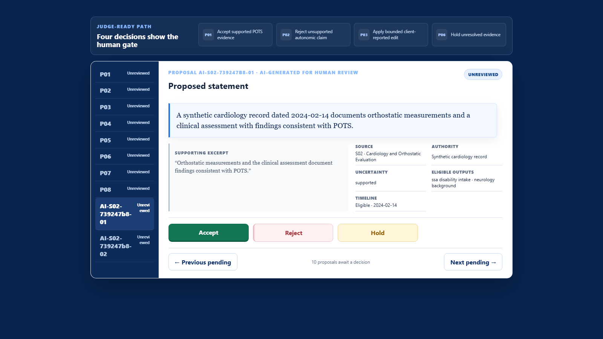
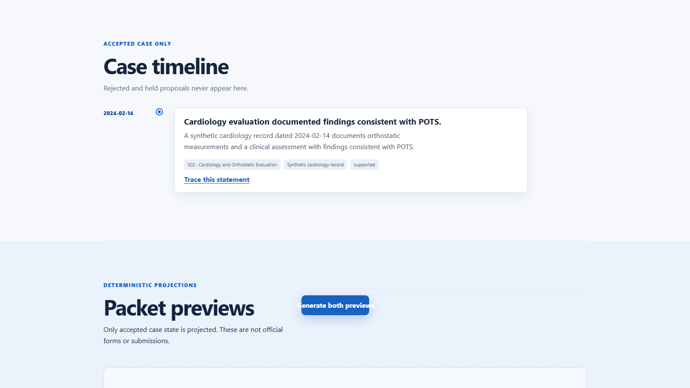
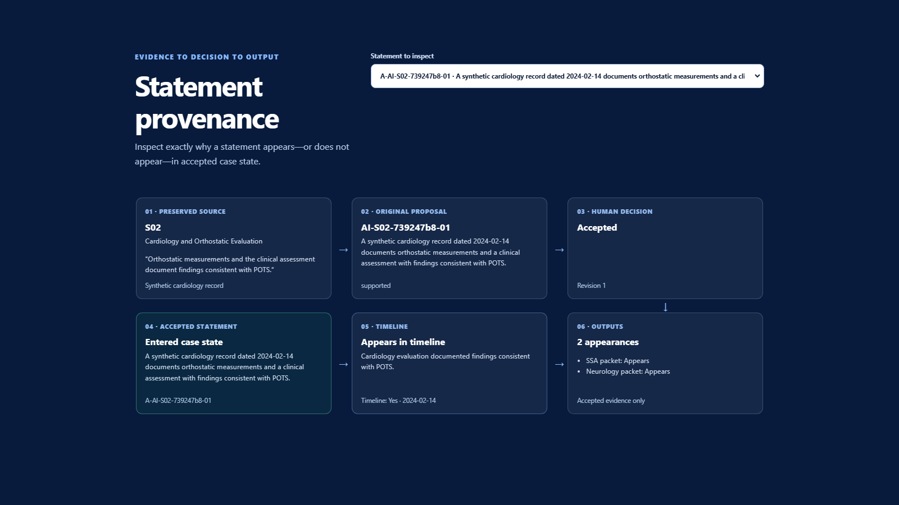

# Neverlost Case Navigator

Neverlost Case Navigator is a synthetic healthcare-consulting demonstration that turns fragmented evidence into a human-reviewed case foundation and traceable disability-focused packet drafts.

**AI proposes. Human decides.**

## What we built

Case Navigator demonstrates a governed case-to-packet workflow for a fully synthetic client, Maya Bennett. It preserves six fragmented source records, uses OpenAI to surface evidence-grounded proposal candidates, keeps every candidate unreviewed until a consultant acts, and projects only reviewed accepted state into the timeline and deterministic packet previews.

It is designed for people, advocates, healthcare consultants, and providers who need to organize complex evidence without silently flattening source authority, uncertainty, or human responsibility.

## The problem

Disability and complex healthcare cases can span providers, portals, tests, referrals, employer records, forms, and personal statements. A generic summary can blur the difference between clinician documentation, client reports, missing evidence, and unsupported conclusions. Case Navigator preserves the source first, then makes interpretation reviewable and traceable.

## Two deliberately separate modes

The deterministic/reference path uses eight pre-authored synthetic proposals and deterministic packet projections. It requires no API key or network request and remains fully reproducible for judges reviewing the repository locally.

The optional live OpenAI-assisted path uses `gpt-5.6-terra` through the server-side Responses API with Structured Outputs. The model supports the Responses API and Structured Outputs according to the [official OpenAI model documentation](https://developers.openai.com/api/docs/models/gpt-5.6-terra).

1. Select one of Maya's six synthetic source fixtures and choose **Analyze S0x with OpenAI**.
2. The browser sends only the selected source ID and local run metadata. The server reconstructs the canonical synthetic fixture rather than trusting browser-submitted source text.
3. OpenAI returns strict structured candidates. Deterministic local validation checks the schema, source allowlist, exact supporting excerpt, evidence category, uncertainty, and prohibited authority conclusions.
4. Valid candidates enter Proposal Review clearly labeled **AI-generated for human review** and **Unreviewed**.
5. Only an explicit human **Accept** or bounded **Edit** can create accepted case state. **Reject** and **Hold** remain traceable without entering the timeline or packet.

OpenAI proposal generation was implemented and live-tested against synthetic source S02, Cardiology and Orthostatic Evaluation. The accepted judge video replays that validated response for deterministic recording and does not make a paid API call while recording.

AI can extract and organize proposal candidates. It cannot accept evidence, modify case truth, determine disability or eligibility, or exercise medical, legal, benefits, or other professional authority.

## Demo workflow

```text
canonical synthetic source
→ OpenAI proposal generation
→ deterministic local validation
→ unreviewed proposal queue
→ human Accept / bounded Edit / Reject / Hold
→ accepted case state
→ timeline
→ deterministic disability-focused packet
→ provenance
```

The packet shown in the submission is generated from reviewed accepted state using the deterministic output path. The experimental `/api/ai/packet-draft` endpoint is quarantined with HTTP 410 and is not part of the successful application or demo path.

## Why AI helps—and where it stops

AI adds value at the evidence-analysis boundary: it can turn a long synthetic record into structured candidate statements and connect each candidate to an exact preserved excerpt. That reduces manual extraction work while keeping the original record visible.

Authority does not move with convenience. Generated candidates carry run provenance and enter only an unreviewed queue. Enqueue is idempotent, stale responses cannot replace newer work, and generation cannot change revision, reviews, accepted statements, timeline, outputs, or authoritative activity.

## Architecture



The provider-neutral `ProposalGenerationAdapter` keeps the deterministic reference adapter separate from `OpenAIProposalGenerationAdapter`. A dedicated asynchronous orchestrator reconstructs authorized fixtures, invokes the adapter, validates output, and records run metadata without forcing the synchronous deterministic service API to become asynchronous.

The OpenAI request is server-only, uses `store: false`, supplies no tools, allows no retrieval, and is bounded to strict structured output. The current first tranche supports exactly one authorized synthetic source per live generation run.

## Screenshots

### OpenAI candidate enters review as unreviewed



### Accepted case timeline



### Statement provenance



## Run locally

Requirements: Node.js compatible with Next.js 15 and pnpm 11.9.0.

```sh
pnpm install --frozen-lockfile
pnpm dev
```

Open `http://127.0.0.1:3000`.

The deterministic/reference workflow works without an API key. To enable optional live OpenAI proposal generation, copy `.env.example` to the local ignored `.env.local` file and set:

```text
OPENAI_API_KEY=your_project_key
```

Never commit `.env.local`, never expose the key through a `NEXT_PUBLIC_` variable, and never use real patient data.

## Verification

```sh
pnpm typecheck
pnpm lint
pnpm test
pnpm build
```

The test suite covers the deterministic case workflow, provider-neutral adapters, mocked OpenAI success/refusal/malformed/failure paths, exact-quote grounding, source reconstruction, idempotency, stale results, authority invariants, component behavior, packet-draft quarantine, and reset equivalence.

## Automated demo video

```sh
pnpm demo:video
```

The command writes the completed silent walkthrough to `artifacts/video/neverlost-case-navigator-demo.webm`. For a reproducible judge recording, the Playwright harness replays the already live-tested S02 result instead of making another cost-bearing request.

- Thumbnail: [PNG](artifacts/submission/neverlost-case-navigator-thumbnail.png)
- YouTube demo URL: https://youtu.be/LqU7pvqd4n4

## Synthetic-data and safety boundary

All Maya content is newly authored synthetic material. No real person, provider, employer, health system, record, claim, or private Neverlost OS material is included. See [Synthetic data and demonstration notice](SYNTHETIC-DATA-NOTICE.md).

This application is a development and presentation demonstration. It is not approved for production healthcare data, is not medical or legal advice, is not an official SSA form or submission, and makes no production, HIPAA, clinical, legal, security, disability, benefits, or eligibility claim.

## How Codex helped

Codex supported implementation, boundary-focused tests, deterministic browser recording, narration/caption assembly, and repository verification. Human reviewers authorized scope, accepted the synthetic evidence and live smoke-test outputs, approved narration and presentation choices, and retain the final submission decision.

## Known limitations

- In-memory case state resets on refresh and is not a production persistence model.
- The live OpenAI path supports the six included synthetic fixtures and one source per run.
- The deterministic/reference proposal set remains the reproducible no-key mode.
- Experimental AI packet drafting is disabled; packet previews are deterministic projections from accepted state.
- Authentication, real records, production security, HIPAA controls, deployment, official forms, and professional determinations are outside scope.

## Future development

Potential later work includes authenticated multi-case storage, institution-specific authority policies, additional synthetic evaluation cases, accessibility studies, and separately reviewed production security/compliance architecture. None of those capabilities is claimed by this submission.

## License

Released under the [MIT License](LICENSE).
